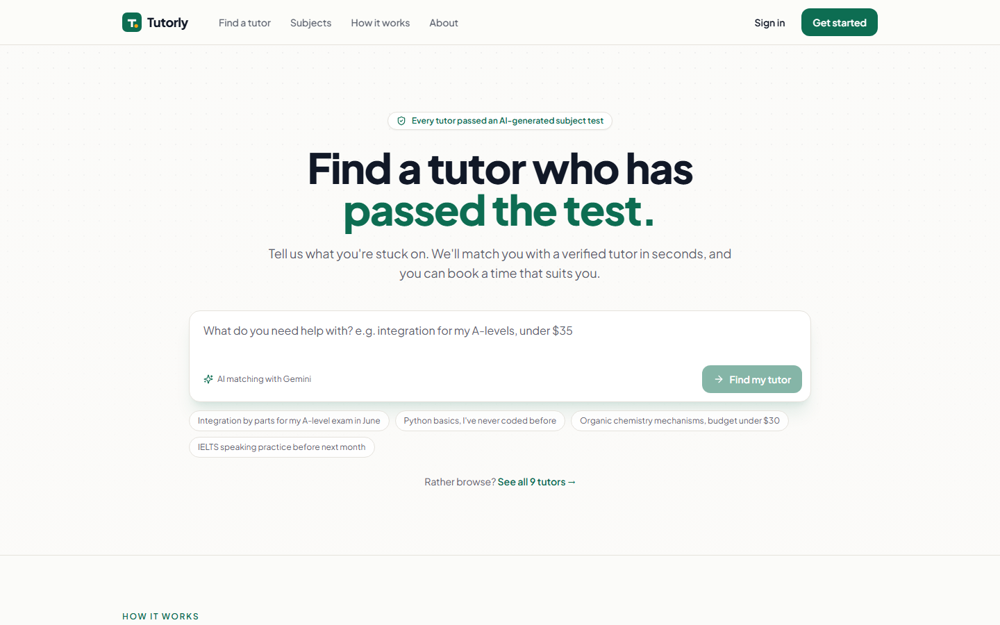
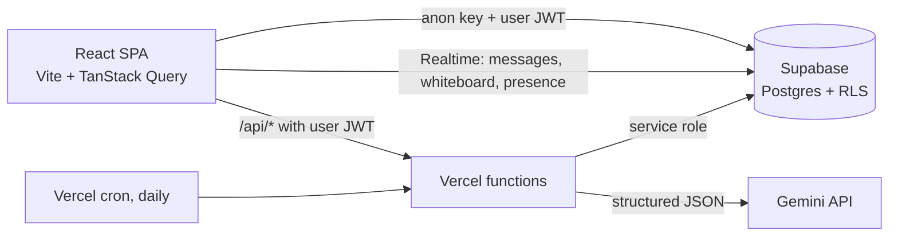

# Tutorly

A tutoring marketplace where every tutor passes an **AI-generated subject test** before they can teach, and students find tutors by **describing what they need in plain words**.

**Live demo: _coming soon_** · Sign in with the demo student or demo tutor on the login page. No sign-up needed.



## What it does

| For students | For tutors |
| --- | --- |
| Describe a need ("integration by parts for my A-levels, under $35") and get the 3 best-fitting tutors, each with a reason | Take an 8-question test written fresh by Gemini for each attempt; score 75% to add the subject |
| Book from real open slots, converted from the tutor's timezone to yours | Publish weekly hours and a rate; accept or decline requests |
| Message tutors live, then join a lesson room with a shared whiteboard | Mark lessons completed; ratings update from reviews |

Plus an admin dashboard with live stats, tutor moderation and a contact inbox.

## How it's built



- **Frontend:** React 18, TypeScript, Vite, Tailwind, shadcn/ui, TanStack Query.
- **Database and auth:** Supabase Postgres, Auth, Storage and Realtime. Business rules live in SQL.
- **AI:** Gemini Flash (rolling `gemini-flash-latest` alias, with retries and a Flash-Lite fallback) and JSON-schema output, called only from Vercel serverless functions.
- **Tests:** Vitest. The migration runs in-process on [PGlite](https://pglite.dev) (real Postgres in WebAssembly), with Supabase's roles stubbed in.

## Engineering decisions worth reading

**The database is the security boundary.** The browser holds only the public anon key, so every rule is enforced in Postgres:

- RLS on every table, plus **column-level grants**: users can update their bio but get `permission denied` on `role`, `is_verified`, `subjects` or `rating`.
- Bookings go through `request_booking()`, which checks the student, the tutor's verified subjects, lead time and a pending-request cap. It computes the price from the tutor's rate rather than trusting the client.
- A **GiST exclusion constraint** makes overlapping bookings for a tutor impossible, even when two students race for the same slot.
- Students' profiles are private. You can only see someone you have a booking or a conversation with. Tutors can reply to students but can't cold-message them.

[`tests/db/schema.test.ts`](tests/db/schema.test.ts) checks all of this from the point of view of anonymous visitors, students, tutors and admins (33 tests).

**AI verification that can't be gamed** ([`api/verification`](api/verification)):

1. Gemini generates 11 questions against a JSON schema.
2. A **second, blind Gemini pass** answers every question. Any question where it disagrees with the key is dropped, so tutors aren't failed by a wrong answer key.
3. Options are shuffled server-side (models put the right answer first far too often), and the answer key is stored in a column clients have no grant on.
4. Grading happens on the server. Only the service role can add a subject to a profile.

**AI matching with a fallback** ([`api/match.ts`](api/match.ts)): the schema restricts `tutor_id` to an enum of real tutor IDs, so the model can't invent tutors. The student's text is fenced and treated as untrusted. If Gemini is down or over quota, keyword matching takes over and search keeps working.

**Timezones without a library** ([`src/lib/time.ts`](src/lib/time.ts)): tutors publish weekly hours in their own timezone. Slots are generated with `Intl`, are DST-safe, and are tested across the London clock change.

**Keeping a free-tier project alive:** a daily Vercel cron resets the demo data. The same writes stop Supabase from pausing the project for inactivity.

## Run it locally

```bash
npm install
cp .env.example .env.local      # add your Supabase and Gemini keys
npm run dev                     # app + /api routes on http://localhost:8080
```

Set up the database once: run [`supabase/migrations/20261005000000_init.sql`](supabase/migrations/20261005000000_init.sql) in the Supabase SQL editor, then `npm run seed` to load the demo data.

```bash
npm test          # database security tests + unit tests
npm run typecheck
npm run build
```

Full deployment steps are in [docs/DEPLOY.md](docs/DEPLOY.md).

## History

Tutorly began in 2025 as a fast prototype. In October 2026 I rebuilt it for production: moved the AI calls server-side (the prototype shipped an API key in the browser), wrote the schema with RLS and tests, replaced simulated features (wallet, classroom, admin stats) with real ones, and redesigned the UI.

Built by [Zuhair Khalid](https://www.linkedin.com/in/zuhairkhalid).
